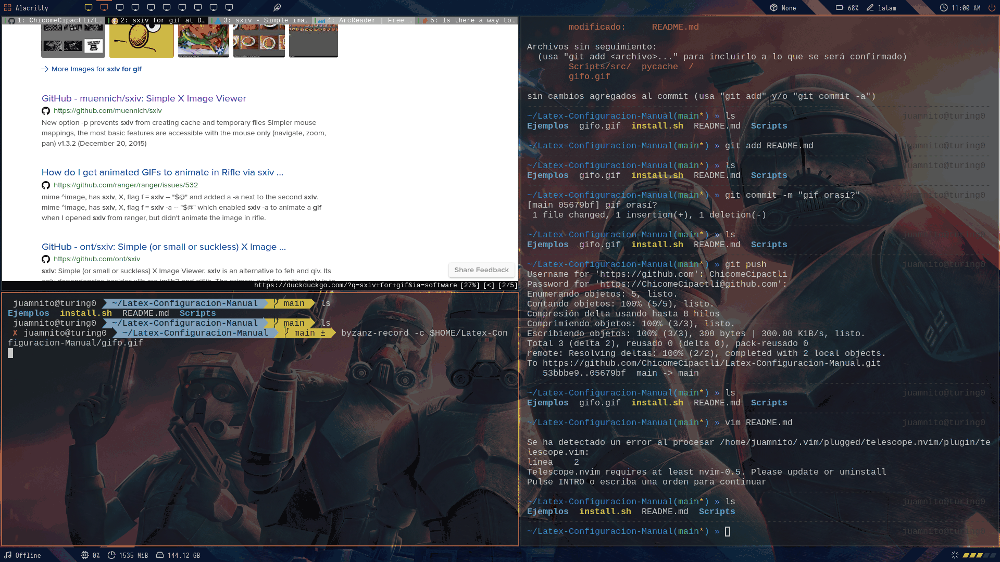

# T-scripts

Este proyecto es una configuración que puede ser de utilidad al momento de empezar un nuevo proyecto cuando quieras hacer 
tus tareas de matemáticas en [LaTeX](https://en.wikipedia.org/wiki/LaTeX).
El objetivo de esto es evitar copiar archivos y creando tu entorno de trabajo 
a mano, ya que sin darte cuenta desperdicias un porcentaje considerable de tu vida 
haciendo clicks que puedes evitar.
Sobre todo también es útil por si quieres mantener la configuración de la tarea anterior o si quieres modificar la configuración 
para tareas futuras.

## Dependencias

Esta configuración está siendo desarrollada desde un sistema basado en [Arch Linux](https://wiki.archlinux.org/title/Arch_Linux),
sin embargo se espera que su funcionamiento sea igual para cualquier distribución de Linux mientras sea capaz de ejecutar:

- [Make](https://es.wikipedia.org/wiki/Make)
- [Python](https://es.wikipedia.org/wiki/Python)

Si no eres capaz de ejecutarlos seguramente no los tienes instalados. El proceso de instalación depende de cada distribución.

## Instalación

### Linux

Dirígete a la carpeta `$HOME` de tu usuario de linux (simplemente ejecutando `cd`) y clona el repositorio con 
```
git clone https://github.com/ChicomeCipactli/Latex-Configuracion-Manual.git
```
Después desplázate hacia dicho repositorio (`cd $HOME/Latex-Configuracion-Manual`)
y ejecuta el script de instalación `./install.sh`.


El script de instalación escribirá al final de tu `.bashrc` y de tu `.zshrc` (si usas [zsh](https://wiki.archlinux.org/title/zsh))
la siguiente línea
```
export PATH=~/Latex-Configuracion-Manual/Scripts/:$PATH
```
Esto hará que los scripts de [bash](https::/wiki.archlinux.org/title/bash) de la carpeta `$HOME/Latex-Configuracion-Manual/Scripts/` sean reconocidos por tu sistema.
Podrás ejecutarlos dondequiera que estés.

## Configuración

Dirígete a la carpeta `$HOME/Latex-Configuracion-Manual/Ejemplos`. 
Ahí hay 3 ejemplos de proyectos `analisis-matematico-I`, `topologia-I`, `ecuaciones-diferenciales-parciales-I` y `metodos-numericos`.
Cada uno es una plantilla de un proyecto de [LaTeX](https://en.wikipedia.org/wiki/LaTeX) útil para mis tareas de la escuela.
La configuración de dichos proyectos depende de cómo quiero que funcionen mis tareas, pero puedes modificar sus nombres y toda 
la configuración para que se adapte a tu forma de trabajar, siempre y cuando no elimines el archivo `makefile` y seas cuidadoso con el archivo `tree.files`.

En la sección [Uso](#Uso) verás cómo generar el árbol de ejercicios. Por defecto cada ejercicio tiene nombre `ej<+>.tex` 
pero estoy trabajando para que puedas modificarlo
cada vez que comiences un nuevo proyecto con el proceso que se describe en dicha sección.

## Uso

Supongamos que vas a empezar una nueva tarea en el directorio `/`

