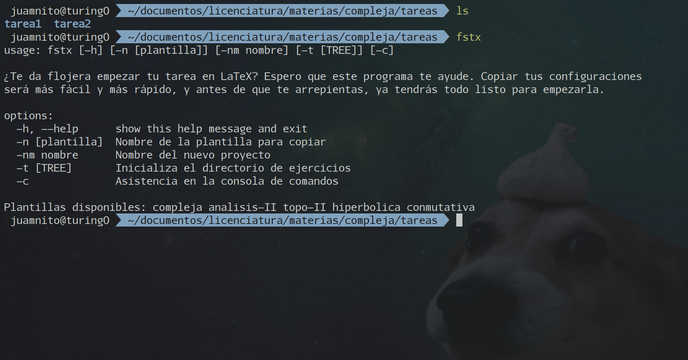
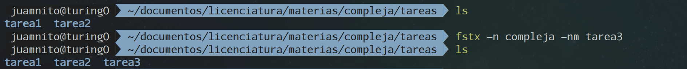
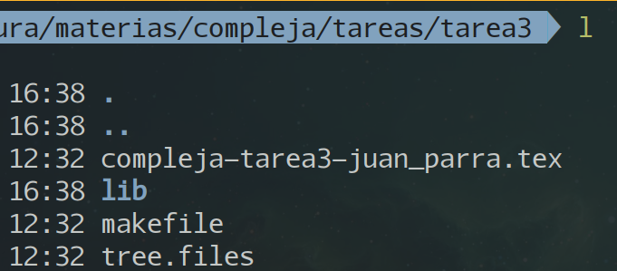
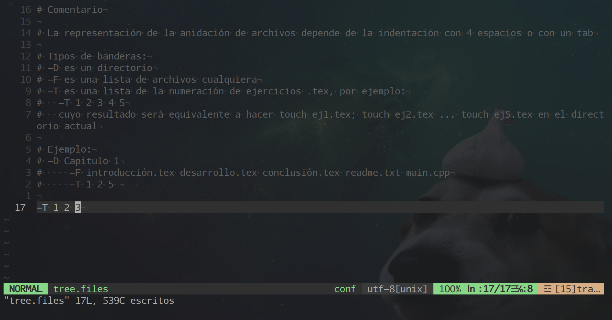
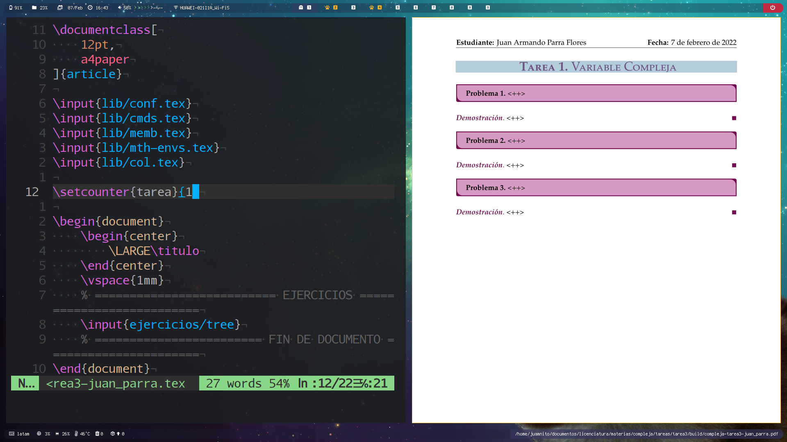

# fstx

I wrote some python scripts to automate some usefull actions for your [LaTeX](https://www.latex-project.org/) homework. You may want to keep your own configurations so I am looking forward to make it happen in the future. For now, I brought some default configs in case you want to use Instalation.

## Only for linux :(
 
### Dependencies
You need to have [python](https://www.python.org/) installed on your machine, and for a complete experience of this scripts get [Make](https://www.gnu.org/software/make/) installed as well.

### Installation
Once you cloned this repo, you'll have to type `cd fstx` on your terminal, and then install it with
```
sudo make install
```
In case you want to uninstall the scripts, it has the option
```
sudo make uninstall
```

## Usage
This is an example of my own workflow, so this may not be the way you love working. There will be more features that I hope will work for you: copy your own templates.

1. Open a terminal in the place you want tobegin your homework. Type `fstx` to see what options or flags you can use depending on what you want. It will show something like this)
<p align="center">
	
</p>

2. Let's say you want to copy the LaTeX template you made for the subject 'Complex Analysis'. In this  case that's the template named `compleja`. 
As you can see, Im going to start my `tarea3` (spanish). So I am gonna type the next command, so the template is coppied here with the name `tarea3`
```
fstx -n compleja -nm tarea3
```
<p align="center">
	
</p>

3. Get into that folder and check what it has 
<p align="center">
	
</p>
There is a `tree.files` file. Open it with your favorite text editor and edit the last line like this. 
<p align="center">
	
</p>

That means that I want to write my solutions for three math problems.
Save and close your text editor and then type the next command
```
fstx -t
```
which will create three files (each one for the corresponding exercise), and place them in the `./ejercicios` folder.

4. Open the `.tex`file and replace `<++>` element with the number of the homework. After compiling, this is what you get
<p align="center">
	
</p>
